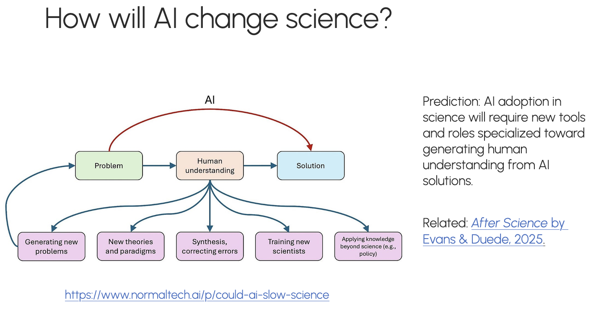

The use of generative AI in the automation of research began in 2025 and continues relentlessly. This begs the important question asked by Arvind Narayanan -- "[What will be left for us to work on?](https://www.cs.princeton.edu/~arvindn/talks/icml-2026-annotated-slides/)" I urge you to read through this presentation, it offers a useful framework for thinking about AI automation of the world, not just research. It's based on the philosophy that AI is yet another normal technology [@narayanan_ai_2025] that will diffuse through the economy albeit in a very different disruption pattern than others. As we may imagine, automating research will call for systems that aid humans in understanding the generated results. This process of understanding will also include a process of verification and evaluation of the work done by AI agents. 

Here, we aim to understand the various research that seeks to automate research. After that, we'll also look at whether this means the end of academic research as we know it. 

## References

<!-- Compile with:

pandoc auto-research.md --citeproc -o auto-research.pdf -V link-citations=true -V urlcolor=blue -V linkcolor=blue -V citecolor=blue -->